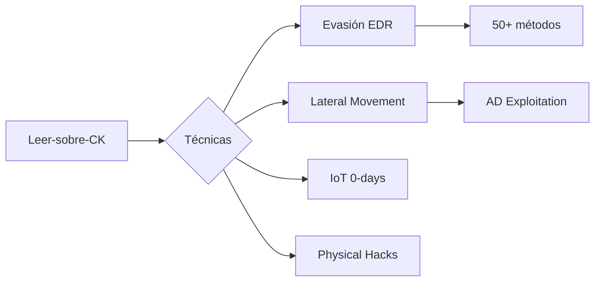
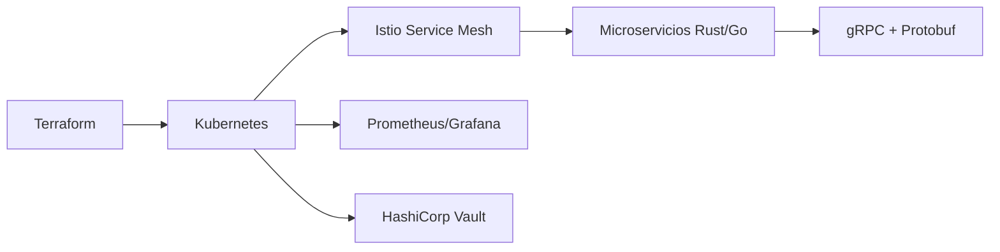

  
</


---

<div align="center">
  
  <!-- Fila 1: Estadísticas Generales -->
  
  

  <!-- Fila 2: Gráfico de Actividad (Terminal Style) -->
  

  <!-- Fila 3: Trofeos Relevantes -->
  

  <!-- Fila 4: Stack Técnico (Lo más importante para un perfil como el tuyo) -->
  <h3>🛠️ Arsenal Técnico & SDR Stack</h3>
  

  <!-- Fila 5: Insignias de Estado -->
  <a href="https://github.com/KevinDevSecOps/Redteam-ttacticks-ps-byCK">
    
  </a>
  

</div>

---
<h1 align="center">
  

<p align="center">
  
  
  <a href="kpcoolkids@gmail.com"></a>
</p>


<div align="center">

[](https://github.com/KevinDevSecOps/KaliNova)
  
   ## 🌌 NovaVision - El Ojo que Todo lo Ve
- 🤔 I’m looking for help with ...
- 💬 Ask me about ...
- 📫 How to reach me: ...
- 😄 Pronouns: ...
- ⚡ Fun fact: ...
-->
[](https://git.io/typing-svg)

<br>

[](https://github.com/KevinDevSecOps)
[](https://github.com/KevinDevSecOps)

</div>

---

## 🎯 **Perfil Táctico**
```yaml
hacker:
  nombre: "Kevin"
  alias: "CoolKiids"
  rol: "Iot Architech | Red Team Operator | Reverse Engineer"
  experiencia: "8+ años"
  especialidades:
    - "IoT Hardware Hacking (UART/JTAG/SPI)"
    - "Firmware Reverse Engineering (ARM/MIPS)"
    - "Radio Frequency (SDR/HackRF/Flipper Zero)"
    - "Cloud-Native Security (K8s/Docker)"
  certificaciones: ["OSCP", "CEH", "EJPT"]
  arsenal: ["Flipper Zero", "HackRF One", "Proxmark3", "Bus Pirate", "Logic Analyzer"]
  filosofía: "Si no lo puedes abrir, no es tuyo... pero siempre documenta"
```

---

🔬 Especialidades Técnicas
```python
class HackerStory:
    def __init__(self):
        self.phase_one = "🔧 2015: Desarmando juguetes electrónicos"
        self.phase_two = "💻 2016: Kali Linux en una laptop quemando CPU"
        self.phase_three = "🏆 2020: Certificaciones OSCP/CEH conseguidas"
        self.current_status = "☠️ 2023: Rompiendo IoT en Fortune 500"
    
    def motto(self):
        return "Nunca dejé de romper cosas... solo que ahora me pagan por ello"

my_story = HackerStory()
```

---

## 🛠️ Arsenal del Caos

### 💣 Dispositivos Favoritos
| Dispositivo | Uso | Nivel de Destrucción |
|-------------|-----|----------------------|
|  | Clonar RFID/Pentesting físico | 🔥🔥🔥🔥🔥 |
|  | Ataques RF/SDR | 🔥🔥🔥🔥 |
|  | Clonar tarjetas de acceso | 🔥🔥🔥🔥 |

### 🧠 Conocimiento Táctico (CK)


---

## 📜 Certificaciones (Para los que les gustan los papeles)
<div align="center">
   
  
  
</div>

---

## 🌟 Proyectos Estrella
### 1. [IoT-Pentest-Guide](https://github.com/KevinDevSecOps/IoT-Pentest-Guide)
```bash
# Lo que la gente dice:
$ curl -X GET https://api.github.com/repos/KevinDevSecOps/IoT-Pentest-Guide/stargazers 
"response": "¡Este hombre hace que los tostadores parezcan armas!"
```

### 2. [Flipper-Zero-Scripts](https://github.com/KevinDevSecOps/Flipper-Zero-Scripts)
```nasm
; Ejemplo de código:
mov [payload], "Kevin's Magic"
int 0x80  ; Dispara el caos
```

### 3. [RedTeam-Toolkit](https://github.com/KevinDevSecOps/RedTeam-Toolkit)
```python
def execute():
    print("Cuando necesitas resultados, no herramientas genéricas")
```

---

## 📊 Mis Números (Porque los hackers también cuentan)
```diff
+ 8 años pirateando sistemas
+ 15 dispositivos IoT vulnerados
+ 3 certificaciones de élite
! ∞ ganas de seguir aprendiendo
```

---

## 🤝 ¿Quieres Unirte al Caos?
<div align="center">
  <a href="https://twitter.com/messages/compose?recipient_id=TU_ID">
    
  </a>
  <a href="https://github.com/KevinDevSecOps/Leer-sobre-CK/issues/new">
    
  </a>
</div>

<br>

<div align="center">
  
</div>

> **Disclaimer:** No me hago responsable si usas esto para hacer que el microondas mine Bitcoin  
> — Con cariño hacker, Kevin CK.

```markdown
## 🔬 **Laboratorio de Ingeniería Inversa**

<div align="center">

[](https://github.com/KevinDevSecOps)
[](https://github.com/KevinDevSecOps)
[](https://github.com/KevinDevSecOps)

</div>

---

### 🔌 **Interfaces Hardware** — *Donde la magia comienza*

<div align="center">

| 🎯 Interfaz | ⚡ Herramientas | 🛠️ Técnicas Reales |
|:-----------:|:---------------:|:-------------------|
| **UART** | `FT232H` `Bus Pirate` | • Identificación TX/RX/GND con osciloscopio<br>• By-pass de prompts de contraseña<br>• Extracción de bootlogs para mapeo |
| **JTAG/SWD** | `J-Link EDU` `OpenOCD` | • Debugging en vivo de ARM Cortex-M<br>• Unlock de fuses de protección<br>• Dump de flash vía boundary scan |
| **SPI/I2C** | `Saleae Logic Pro` `Beagle` | • Sniffing MCU ↔ Flash externa<br>• Captura handshakes de sensores<br>• Extracción de EEPROMs 24Cxx |

</div>

```python
# 🎯 Identificación de UART (método del pobre)
import machine
from time import sleep

# 1. Buscar GND con continuidad
# 2. Probar pines con osciloscopio a 115200 baudios
# 3. Conectar y rezar
uart = machine.UART(2, baudrate=115200, tx=17, rx=16)
while True:
    if uart.any():
        print(f"📥 Bootlog: {uart.read()}")
```

---

🧠 Firmware: De Binario a Código Fuente


<details>
<summary><b>📋 Pipeline Completo de Extracción</b></summary>```bash
# 🔓 Método 1: Chip Clamp (sin desoldar)
flashrom -p ch341a_spi -r firmware_dump.bin

# 🔓 Método 2: Vía U-Boot (si hay shell)
# Interrumpir boot y:
md 0x80000000  # Leer memoria física

# 🔓 Método 3: OTA Intercept (ESP32/ESP8266)
mitmproxy -p 8080 --ssl-insecure
# La actualización cae sola 😈
```

</details><details>
<summary><b>🔍 Técnicas de Análisis Favoritas</b></summary>Técnica Herramienta Resultado Típico
Strings + Grep strings firmware.bin | grep -E 'key|pass|secret' 🔑 API keys, contraseñas
Entropía binwalk -E firmware.bin 🔐 Secciones cifradas/comprimidas
Diff de versiones kdiff3 v1.bin v2.bin 🩹 Parches de seguridad (o backdoors)
Firmwalker ./firmwalker.sh /extracted/ 🗺️ Mapa de archivos peligrosos

</details>---

💣 Explotación IoT — Cuando las defensas fallan

<div align="center">🎯 Ataque ⚡ Dificultad 🛡️ Bypass
Voltage Glitching █████░░░░░ • Bootloader desbloqueado • Readout Protection (RDP) off
Power Analysis (CPA) ████████░░ • Claves AES extraídas • ~2000 trazas necesarias
EM Fault Injection █████████░ • Saltos de instrucción • Verificación de firmas bypasseada

</div>```python
# ⚡ Script básico de Voltage Glitching con Crowbar
import machine
import time

# Configurar MOSFET para cortar VCC
glitch_pin = machine.Pin(4, machine.Pin.OUT)

def glitch_attack(duration_us=10):
    """Corta la alimentación por microsegundos"""
    glitch_pin.off()
    time.sleep_us(duration_us)  # ¡El pulso mágico!
    glitch_pin.on()
    
# Normalmente requiere cientos de intentos...
for i in range(1000):
    glitch_attack()
    if check_if_unlocked():  # ¿RDP desactivado?
        print(f"🎉 ¡Glitch exitoso en intento {i}!")
        break
```

---

🏆 Hallazgos Reales

<div align="center">https://img.shields.io/badge/CVEs_Encontrados-3-FF0000?style=flat-square
https://img.shields.io/badge/Firmwares_Extraídos-25+-brightgreen?style=flat-square
https://img.shields.io/badge/Bootloaders_Desbloqueados-5-9cf?style=flat-square

</div>```yaml
📊 Resultados por Año:
  2024: "3 CVEs (buffer overflow HTTP parser, hardcoded creds, UART shell)"
  2023: "12 dispositivos (routers, cámaras IP, enchufes inteligentes)"
  2022: "Bypass Secure Boot en router Mediatek vía glitching ⚡"
  2021: "Primer dump flash exitoso (Sonoff básico)... ¡se hace camino al andar!"
```

---

📸 Setup de Laboratorio

<div align="center">🔬 Estación de Trabajo 📡 RF & Wireless 🔧 Herramientas Físicas
Saleae Logic Pro 8 HackRF One Estación de soldadura
SPI/I2C/UART sniffing SDR hasta 6 GHz Extracción de chips
J-Link EDU Mini Proxmark3 Easy Microscopio Digital
Debugging ARM SWD/JTAG RFID/NFC clonación Inspección PCB 500x
ChipWhisperer Lite Flipper Zero Bus Pirate v4
Side-Channel Power Analysis Sub-GHz + BLE + RFID Interfaz universal GPIO

</div>---

<div align="center">```ascii
    ⚡ VOLTAGE GLITCHING
    [VCC]───[MOSFET]───[TARGET MCU]
              │
              └── [Pulse 10µs] 💀 RDP OFF
    
    📻 SIGNAL ANALYSIS
    [HackRF]───[GNU Radio]───[Wireshark] 🔓
    
    🔑 MEMORY DUMPING
    [SOIC8 Clip]───[CH341a]───[flashrom] 💾
```


https://img.shields.io/badge/¿Quieres_ver_mi_lab%3F-📸_Fotos_en_Twitter-1DA1F2?style=for-the-badge

</div>
    
    "🧠 Firmware Reverse Engineering": {
        "Extracción": {
            "flash_read": "Desoldering + lector SOP8/SOIC16 con flashrom",
            "spi_dump": "Chip clip directo sin desoldar con Pomona 5250",
            "uart_bootloader": "Interrupción de U-Boot para dump de particiones",
            "ota_intercept": "Captura de firmware OTA con proxy MITM en ESP32"
        },
        "Análisis Estático": {
            "binwalk": "Extracción de filesystems (SquashFS, JFFS2, YAFFS)",
            "ghidra_scripts": "Scripts propios para identificar funciones de crypto",
            "fingerprinting": "Detección de CVEs por hash de binarios conocidos",
            "hardcoded_secrets": "Búsqueda de API keys y certs privados embebidos"
        },
        "Análisis Dinámico": {
            "qemu_full_system": "Emulación completa de firmware ARM/MIPS con -M virt",
            "frida_iot": "Instrumentación de binarios ELF en dispositivos rooted",
            "gdbserver": "Debug remoto de servicios vulnerables en vivo",
            "unblob": "Pipeline automatizado de extracción multi-nivel"
        },
        "Casos Reales": [
            "🔓 Extracción de firmware cifrado de router TP-Link vía U-Boot shell",
            "📡 Backdoor en IP camera: credenciales en /etc/shadow con hash débil",
            "🔑 Clave privada RSA en strings de binario de cerradura inteligente",
            "💊 Dispositivo médico con actualizaciones OTA sin firma verificada"
        ]
    },
    
    "💣 Técnicas de Explotación": {
        "Fault Injection": {
            "voltage_glitching": "Crowbar + Mosfet para bypass de readout protection",
            "em_fault": "PicoEMP para saltar instrucciones de verificación de firma",
            "laser_fault": "Ataque básico con laser pointer a decapsulados (teórico/practicado)",
            "resultado": "Bootloader desbloqueado en MCU STM32F4 con RDP nivel 1"
        },
        "Side-Channel": {
            "power_analysis": "ChipWhisperer Lite + capture de trazas CPA",
            "timing_attack": "Análisis de tiempo en verificación de PINs (Python + osciloscopio)",
            "em_analysis": "Sonda H-Field para capturar emanaciones de AES-128",
            "resultado": "Clave de 16 bytes recuperada en 2000 trazas"
        },
        "EEPROM/Flash Attacks": {
            "i2c_eeprom": "Lectura de configuraciones en 24C02 sin protección",
            "spi_flash": "Modificación de particiones de firmware en W25Q64",
            "nand_glitch": "Bypass de bad block markers en NAND flash",
            "resultado": "MAC address y serial numbers modificados para bypass de auth"
        }
    }
}

📡 Radiofrecuencia & Wireless

Banda Herramienta Técnica
Sub-GHz (315/433/868 MHz) HackRF + PortaPack Captura y replay de mandos RF
2.4 GHz Flipper Zero + NRF24 Sniffing BLE/Mousejacking
RFID/NFC Proxmark3 Easy Clonación y emulación de tarjetas
WiFi Alfa AWUS + Kismet Ataques WPA3-Transition

🏗️ Cloud-Native & DevSecOps



---

🌟 Proyectos Destacados

Repositorio Descripción Tipo
PortaPack-Havoc-Mod Firmware RF avanzado para HackRF https://img.shields.io/badge/SDR-red
RF-Hacking-Tools Suite de scripts para análisis de espectro https://img.shields.io/badge/RF-orange
Flipper-Zero-Scripts Payloads personalizados BadUSB/SubGHz https://img.shields.io/badge/IoT-blue
IoT-Pentest-Guide Metodología completa de hardware hacking https://img.shields.io/badge/Hardware-green
Leer-sobre-CK Base de conocimiento Red Team TTPs https://img.shields.io/badge/Red_Team-purple

---

📊 Experiencia Real

```diff
+ 2024: Firmware reverse engineering de 3 dispositivos IoT médicos (CVEs encontrados)
+ 2023: Auditoría de seguridad RF en sistemas de control industrial
+ 2022: Desarrollo de PoC para BLE spoofing en cerraduras inteligentes
+ 2021: Charla en NoConName: "RFID Hacking con Flipper Zero"
! Siempre: Documentando todo en mi wiki personal de técnicas
```

---

👵💻 Explicación para tu abuela

"Abuela, básicamente hago tres cosas:

🔧 Destripar aparatos: Abro los cacharros electrónicos para ver qué tienen dentro y cómo funcionan de verdad.
📻 Jugar con ondas: Estudio las señales de radio que usan tus dispositivos (WiFi, mando del garaje, etc.).
🛡️ Decirles a las empresas cómo protegerse: Después de encontrar los fallos, les explico cómo arreglarlos.

Y sí, todo legal... que me gusta dormir en mi cama, no en un calabozo."

---

🛠️ Toolkit Completo

```bash
# Hardware
├── Flipper Zero          # Navaja suiza del hacking
├── HackRF One + PortaPack # Laboratorio RF portable
├── Proxmark3 Easy        # Clonación RFID/NFC
├── Bus Pirate v4         # Interfaz universal (UART/I2C/SPI/JTAG)
├── Saleae Logic 8        # Analizador lógico para reverse
├── ChipWhisperer Lite    # Side-channel attacks
└── Alfa AWUS036ACH       # WiFi hacking (monitor mode + injection)

# Software
├── Ghidra               # NSA reverse engineering suite
├── Binwalk              # Firmware extraction
├── GNU Radio            # DSP para SDR
├── Wireshark            # Network protocol analysis
├── QEMU                 # Firmware emulation
└── Radare2              # Binary analysis framework
```

---

<div align="center">https://img.shields.io/badge/Twitter-1DA1F2?style=for-the-badge&logo=twitter&logoColor=white
https://img.shields.io/badge/LinkedIn-0077B5?style=for-the-badge&logo=linkedin&logoColor=white
https://img.shields.io/badge/Blog-FF5722?style=for-the-badge&logo=blogger&logoColor=white

https://komarev.com/ghpvc/?username=KevinDevSecOps&color=blueviolet&style=flat-square

"La seguridad no es un producto, es un proceso... y yo soy el que lo rompe para mejorarlo" 🔥

