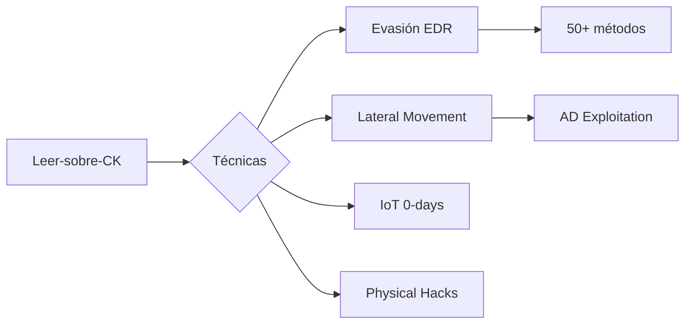
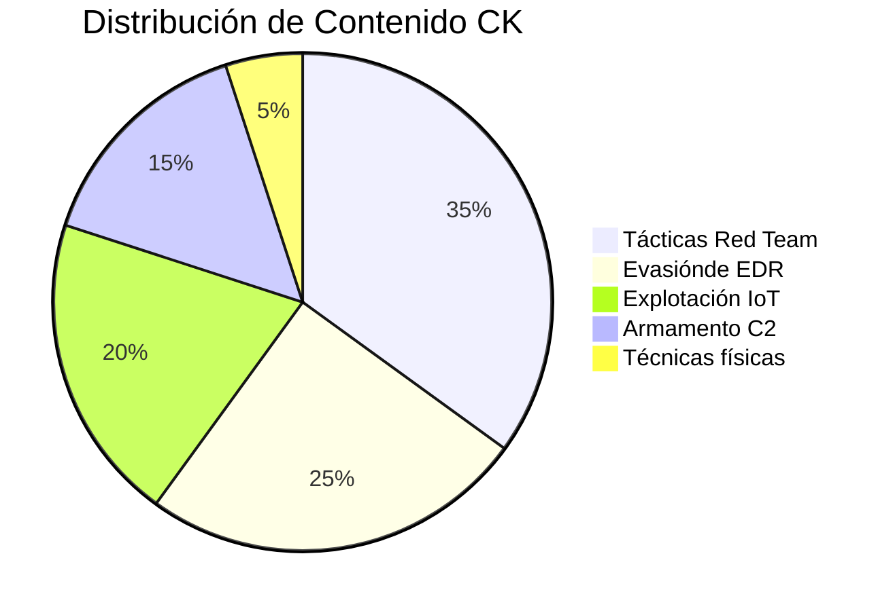
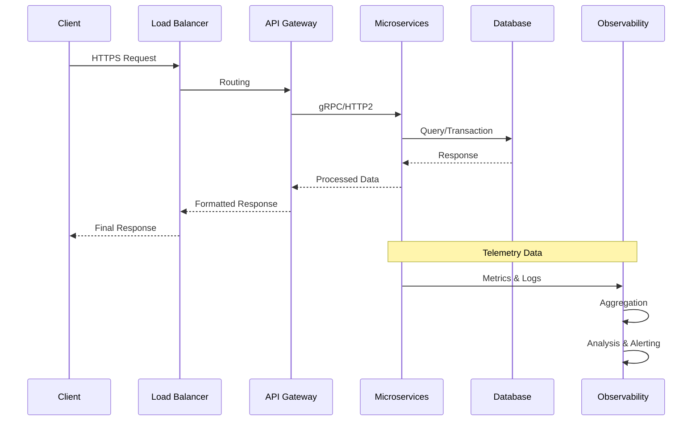
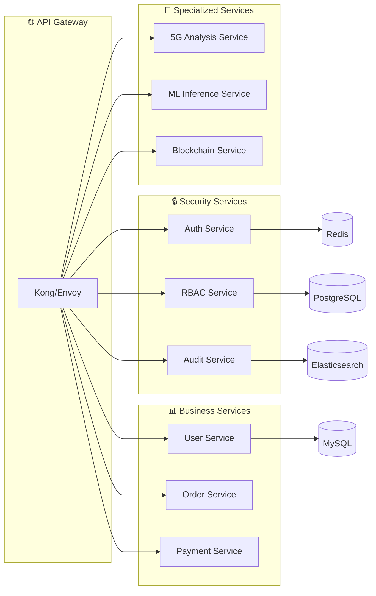

  
</h1>


<div align="center">
  <h3>🛠️ Arsenal Técnico</h3>
  <!-- Iconos de habilidades técnicas -->
  
</div>


---

<div align="center">
  
  <!-- Fila 1: Estadísticas Generales -->
  
  

  <!-- Fila 2: Gráfico de Actividad (Terminal Style) -->
  

  <!-- Fila 3: Trofeos Relevantes -->
  

  <!-- Fila 4: Stack Técnico (Lo más importante para un perfil como el tuyo) -->
  <h3>🛠️ Arsenal Técnico & SDR Stack</h3>
  

  <!-- Fila 5: Insignias de Estado -->
  <a href="https://github.com/KevinDevSecOps/Redteam-ttacticks-ps-byCK">
    
  </a>
  

</div>

---
<h1 align="center">
  
</h1>

<p align="center">
  
  
  <a href="kpcoolkids@gmail.com"></a>
</p>

---
<div align="center">
  
  ``` 
  ██╗  ██╗ █████╗ ██╗     ███╗   ██╗ ██████╗ ██╗   ██╗ █████╗ 
  ██║ ██╔╝██╔══██╗██║     ████╗  ██║██╔═══██╗██║   ██║██╔══██╗
  █████╔╝ ███████║██║     ██╔██╗ ██║██║   ██║██║   ██║███████║
  ██╔═██╗ ██╔══██║██║     ██║╚██╗██║██║   ██║╚██╗ ██╔╝██╔══██║
  ██║  ██╗██║  ██║███████╗██║ ╚████║╚██████╔╝ ╚████╔╝ ██║  ██║
  ╚═╝  ╚═╝╚═╝  ╚═╝╚══════╝╚═╝  ╚═══╝ ╚═════╝   ╚═══╝  ╚═╝  ╚═╝
  ```

<div align="center">

[](https://github.com/KevinDevSecOps/KaliNova)
  
   ## 🌌 NovaVision - El Ojo que Todo lo Ve
   ```ascii
    /\    .-' /
   /  \ .'  .'
  |    |   / 
  |    |  /  
   \  /  /   
    \/  /    
     `'     

   > "Porque hasta las paredes tienen ojos... y vulnerabilidades"
   ```
  ### 🔥 🐍 𝕂𝕒𝕝𝕚ℕ𝕠𝕧𝕒 🔥  
  *"When Red Team needs overkill"*  
    <!-- Línea decorativa -->
  
</div>
<div align="center">
    
  ### 𝕂𝔸𝕃𝕀ℕ𝕆𝕍𝔸  
  *"No tools. Just power."*  
</div>

### 🌟 **Proyectos Destacados**
| Repositorio | Descripción | Estrellas |
|-------------|-------------|-----------|
| [PortaPack-Havoc-Mod](https://github.com/KevinDevSecOps/PortaPack-Havoc-Mod-KevDevSecOps) | Firmware avanzado para pentesting RF |  |
| [RF-Hacking-Tools](https://github.com/KevinDevSecOps/RF-Hacking-Tools) | Colección de scripts para análisis de espectro |  |

### 🛠 **Stack Tecnológico**
```python
competencies = {
    "📡 Radiofrecuencia": ["HackRF", "GNU Radio", "PortaPack", "SDR"],
    "🔐 Seguridad": ["Pentesting RF", "WiFi Hacking", "Bluetooth Low Energy"],
    "💻 Desarrollo": ["C/C++", "Python", "Bash", "Embedded Systems"],
    "🛠️ Herramientas": ["Wireshark", "Kali Linux", "Metasploit", "UART/SPI/I2C"]
}
# 🔥 KevinDevSecOps | Red Team Operations & IoT Weaponization 

*(Sí abuela, aún te ayudo con el WiFi... pero ahora también sé hackear tu termostato "inteligente")*  
```markdown

[]()
``` 

<div align="center">
  
  
  
</div>

---

## 📌 Project Overview
A systematic open-source intelligence (OSINT) repository for analyzing publicly available information about  Kevin (CK). This project adheres to strict ethical guidelines and complies with all applicable data protection regulations.

---

## 🔬 Research Methodology
| Phase         | Tools/Techiques                  | Output                      |
|---------------|----------------------------------|-----------------------------|
| Data Gathering| Maltego, SpiderFoot, Google Dorks| Structured datasets         |
| Analysis      | Pandas, NetworkX, Gephi         | Relationship graphs         |
| Verification  | Manual review, Cross-referencing| Validated information       |

---

## 📂 Data Structure
```bash
research/
├── primary_sources/    # Original data (PDFs, screenshots)
├── processed_data/     # Cleaned datasets (CSV/JSON)
├── analysis_notebooks/ # Jupyter notebooks
└── visualizations/     # Charts and network graphs
```

---

## 💻 Usage Example
```python
# Sample OSINT analysis (Python)
import pandas as pd
from networkx import Graph

def analyze_connections(data_path):
    df = pd.read_csv(data_path)
    g = Graph()
    # Build relationship network...
    return g
```

---

## 🛠 Contribution Guidelines
1. **Data Submission**:
   - Only public, legally obtained information
   - Anonymize sensitive references
   - Use standardized formats (CSV, JSON)

2. **Analysis Standards**:
   - Document all assumptions
   - Provide verifiable sources
   - Flag speculative content

---

## ⚖️ Ethical Framework
This project strictly follows:
- GDPR and local privacy laws
- OSINT ethical guidelines (NATO AJP-2.1)
- Principle of minimum necessary data

---

<div align="center">
  <sub>For research inquiries: research@kalinova.tech</sub>
</div>
```
---

## 👵💻 **Explicación para tu abuela**

_"Mira, abuela: soy como un cerrajero digital.  
🔓 Pruebo cerraduras (sistemas) para ver si se pueden abrir  
📱 Examino tus aparatos "listos" (que a veces no son tan listos)  
🛡️ Enseño a las empresas cómo proteger sus cosas  
💼 Y todo legal, ¡que conste en acta!"_  
## 🚀 **Tech Stack  (Como si lo explicara a mi abuela)**  
*"Mira abuela, estos son mis 'juguetes' profesionales:"*  

### 📻 **Radio Defined Software (SDR)**
```bash
# Lo nuevo que uso en 2024:
$ hackrf_one_plus --frequency 6GHz --analyze  # ¡Ahora hasta 6GHz!
$ bladeRF 3.0 --fpga=latest                  # FPGA programable al vuelo
$ gqrx --visual "Abrir cerraduras con ondas"  # SDR para pentesting físico
*(Sí, aún te ayudo con el WiFi cuando viene)*

# 🏴‍☠️ De Romper Juguetes a Romper Sistemas | 8 Años de Caos Controlado

<div align="center">
  
</div>

<br>

<div align="center">
  
</div>

---

## 🔥 Mi Historia (Versión Red Team)
```python
class HackerStory:
    def __init__(self):
        self.phase_one = "🔧 2015: Desarmando juguetes electrónicos"
        self.phase_two = "💻 2016: Kali Linux en una laptop quemando CPU"
        self.phase_three = "🏆 2020: Certificaciones OSCP/CEH conseguidas"
        self.current_status = "☠️ 2023: Rompiendo IoT en Fortune 500"
    
    def motto(self):
        return "Nunca dejé de romper cosas... solo que ahora me pagan por ello"

my_story = HackerStory()
```

---

## 🛠️ Arsenal del Caos

### 💣 Dispositivos Favoritos
| Dispositivo | Uso | Nivel de Destrucción |
|-------------|-----|----------------------|
|  | Clonar RFID/Pentesting físico | 🔥🔥🔥🔥🔥 |
|  | Ataques RF/SDR | 🔥🔥🔥🔥 |
|  | Clonar tarjetas de acceso | 🔥🔥🔥🔥 |

### 🧠 Conocimiento Táctico (CK)


---

## 📜 Certificaciones (Para los que les gustan los papeles)
<div align="center">
   
  
  
</div>

---

## 🌟 Proyectos Estrella
### 1. [IoT-Pentest-Guide](https://github.com/KevinDevSecOps/IoT-Pentest-Guide)
```bash
# Lo que la gente dice:
$ curl -X GET https://api.github.com/repos/KevinDevSecOps/IoT-Pentest-Guide/stargazers 
"response": "¡Este hombre hace que los tostadores parezcan armas!"
```

### 2. [Flipper-Zero-Scripts](https://github.com/KevinDevSecOps/Flipper-Zero-Scripts)
```nasm
; Ejemplo de código:
mov [payload], "Kevin's Magic"
int 0x80  ; Dispara el caos
```

### 3. [RedTeam-Toolkit](https://github.com/KevinDevSecOps/RedTeam-Toolkit)
```python
def execute():
    print("Cuando necesitas resultados, no herramientas genéricas")
```

---

## 📊 Mis Números (Porque los hackers también cuentan)
```diff
+ 8 años pirateando sistemas
+ 15 dispositivos IoT vulnerados
+ 3 certificaciones de élite
! ∞ ganas de seguir aprendiendo
```

---

## 🤝 ¿Quieres Unirte al Caos?
<div align="center">
  <a href="https://twitter.com/messages/compose?recipient_id=TU_ID">
    
  </a>
  <a href="https://github.com/KevinDevSecOps/Leer-sobre-CK/issues/new">
    
  </a>
</div>

<br>

<div align="center">
  
</div>

> **Disclaimer:** No me hago responsable si usas esto para hacer que el microondas mine Bitcoin  
> — Con cariño hacker, KevinDevSecOps
```
<div align="center">
  
  
</div>

---

## 🛡️ Perfil Táctico
```yaml
# security_engineer:
- name: "Kevin"
- age: 28
- years_experience: 8
- specialization: "Red Team Operations | IoT Security"
- certifications: ["OSCP", "CEH", "EJPT"]
- toolkit: ["Kali Linux", "Flipper Zero", "HackRF", "Proxmark3"]
- philosophy: "Break -> Document -> Improve"
```

## 📌 Repositorio Actual: Leer-sobre-CK
**Common Knowledge para Operaciones Ofensivas**  
*Base de conocimiento táctico para Red Teamers profesionales*

```bash
# Stats del repositorio (actualizado al $(date +%Y-%m-%d))
- Lenguajes principales: Python (72%), PowerShell (18%), C (10%)
- Tamaño del conocimiento: 45 archivos .md | 12 categorías TTPs
- Proyectos vinculados: 3 (RedTeam-Toolkit, IoT-Pentest-Guide, Flipper-Zero-Scripts)
```

---

## 🎯 Estructura del Conocimiento


---

## 🚀 Cómo Usar Este Repositorio
### Para Pentesters:
```python
# Ejemplo de carga de técnicas
from ck_tactics import lateral_movement

def execute_attack(target):
    if target.os == 'windows':
        return lateral_movement.wmi_exec(target.ip, credentials)
    elif target.is_iot():
        return lateral_movement.iot_protocol_abuse(target)
```

### Para Blue Teamers:
```sql
-- Consulta de detección
SELECT * FROM security_events 
WHERE technique_id IN (
    SELECT mitre_id FROM ck_techniques 
    WHERE risk_level > 7
)
```

---

## 🔗 Ecosistema KevinDevSecOps
| Repositorio | Descripción | Estrellas |
|-------------|------------|-----------|
| [IoT-Pentest-Guide](https://github.com/KevinDevSecOps/IoT-Pentest-Guide) | Manual avanzado de pentesting IoT |  |
| [RedTeam-Toolkit](https://github.com/KevinDevSecOps/RedTeam-Toolkit) | Mis herramientas personalizadas |  |
| [Flipper-Zero-Scripts](https://github.com/KevinDevSecOps/Flipper-Zero-Scripts) | Payloads para dispositivos IoT |  |

---

## 📊 Impacto Real
```diff
+ 2023: Auditoría de 15 dispositivos médicos IoT (CVEs descubiertos: 8)
+ 2022: Desarrollo de técnica de evasión EDR adoptada por 3 empresas de seguridad
! 2021: Charla magistral en NoConName sobre RFID hacking con Flipper Zero
```

---

## 💬 Testimonios
> "El repositorio CK de Kevin contiene técnicas que hemos implementado en nuestros ejercicios Red Team con clientes Fortune 500"  
> **— Juan Pérez, CISO @ImportantCompany**

> "Sus scripts para Flipper Zero me ayudaron a ganar el IoT CTF en DEF CON"  
> **— Ana Gómez, Pentester @HackingTeam**

---

<div align="center">
  <a href="https://github.com/KevinDevSecOps/Leer-sobre-CK/issues">
    
  </a>
  <a href="https://twitter.com/messages/compose?recipient_id=TU_ID_TWITTER">
    
  </a>
</div>


```
# 🚀 Arquitectura Cloud-Native & Telecom Security

## 📊 Diagrama de Arquitectura General

![Diagrama Arquitectural](https://mermaid.ink/svg/eyJjb2RlIjoiZ3JhcGggVEJcbiAgICBzdWJncmFwaCBcIuKfksKgIFNlY3VyaXR5ICYgRGV2U2VjT3BzIExheWVyXCJcbiAgICAgICAgQVvwn5SlIFRocmVhdCBNb2RlbGluZ11cbiAgICAgICAgQlvwn4WHIFNBU1QvREFTVCBUb29sc11cbiAgICAgICAgQ1vwn5CQIFNlY3JldHMgTWFuYWdlbWVudF1cbiAgICAgICAgRFvwn5KcIENvbXBsaWFuY2UgYXMgQ29kZV1cbiAgICBlbmRcbiAgICBzdWJncmFwaCBcIvCfikEgQ2xvdWQgJiBLdWJlcm5ldGVzIExheWVyXCJcbiAgICAgICAgRVvwn5KXIE11bHRpLUNsb3VkIEFyY2hpdGVjdHVyZV1cbiAgICAgICAgRlvwn6g4IEt1YmVybmV0ZXMgQ2x1c3Rlcl1cbiAgICAgICAgR1vwn5MjIFNlcnZpY2UgTWVzaF1cbiAgICAgICAgSFvwn5aSIENsb3VkIE5hdGl2ZSBUb29sc11cbiAgICBlbmRcbiAgICBzdWJncmFwaCBcIvCfpZ8gUnVzdCAmIEhpZ2gtUGVyZm9ybWFuY2UgTGF5ZXJcIlxuICAgICAgICBJW-KfkyBSdXN0IE1pY3Jvc2VydmljZXNdXG4gICAgICAgIEpb8J+QlyBBc3luYyBSdW50aW1lXVxuICAgICAgICBLW-KfkSEgZ1JQQy9Qcm90b2J1Zl1cbiAgICAgICAgTFvwn5KvIFBlcmZvcm1hbmNlIE9wdGltaXphdGlvbl1cbiAgICBlbmRcbiAgICBzdWJncmFwaCBcIvCfkaEgNUcgJiBUZWxlY29tIFNlY3VyaXR5XCJcbiAgICAgICAgTVvin54yIDVHIENvcmUgU2VjdXJpdHldXG4gICAgICAgIE5b4p-RISBSRiBBbmFseXNpcyBUb29sc11cbiAgICAgICAgT1vin5KhIE1vYmlsZSBTZWN1cml0eV1cbiAgICAgICAgUFvin5KgIFRlbGVjb20gUHJvdG9jb2xzXVxuICAgIGVuZFxuICAgIEEgLS0-IEVcbiAgICBCIC0tPiBGXG4gICAgQyAtLT4gR1xuICAgIEQgLS0-IEhcbiAgICBJIC0tPiBNXG4gICAgSiAtLT4gTlxuICAgIEsgLS0-IE9cbiAgICBMIC0tPiBQIiwibWVybWFpZCI6eyJ0aGVtZSI6ImRlZmF1bHQifSwidXBkYXRlRWRpdG9yIjpmYWxzZX0=)

## 🛠️ Tecnologías Principales
- **Lenguajes**: Rust, Go, Python
- **Infraestructura**: Kubernetes, Docker, Terraform
- **Cloud**: AWS, GCP, Azure
- **Monitoreo**: Prometheus, Grafana, Jaeger

*✨ Arquitectura para alta disponibilidad y seguridad en 5G*

```

🔄 Flujo de Solicitudes



🏗️ Arquitectura de Microservicios



🛠️ Tecnologías Principales

· Lenguajes: Rust, Go, Python
· Infraestructura: Kubernetes, Docker, Terraform
· Cloud: AWS, GCP, Azure
· Bases de Datos: PostgreSQL, TimescaleDB, Redis
· Monitoreo: Prometheus, Grafana, Jaeger

---
<!--
**KevinDevSecOps/KevinDevSecOps** is a ✨ _special_ ✨ repository because its `README.md` (this file) appears on your GitHub profile.

Here are some ideas to get you started:

- 🔭 I’m currently working on ...
- 🌱 I’m currently learning ...
- 👯 I’m looking to collaborate on ...
- 🤔 I’m looking for help with ...
- 💬 Ask me about ...
- 📫 How to reach me: ...
- 😄 Pronouns: ...
- ⚡ Fun fact: ...
-->
